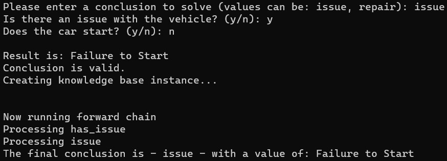

# Car diagnosis software

Artificial intelligence software to assist with diagnosing vehicle errors and damage. 

Authors:     
* [David Torrente](https://github.com/torrente)
* [Borislav Sabotinov](https://github.com/bss8)
* [Randal Henderson](https://github.com/RRHenderson)

## Build and run the application

This application is primarily designed to run on Texas State (TXST) Linux servers. 
Eros: EROS.CS.TXSTATE.EDU (147.26.231.153)
Zeus: ZEUS.CS.TXSTATE.EDU (147.26.231.156)

Upon invoking the program, the knowledge base (KB) file will be parsed and if correctly formatted, each statement (line) will be processed and displayed to the console.

### Automated build with log file

Simply run the below command from the root directory:     
 `./buildAndRun.sh`

After a complete run, log will be in root dir as `vehicle_diagnosis.log`

### Manual build (no log)

To build locally: `make`

To see the help menu:     
`./VehicleRepairAndDiagnosis -h` OR     
`./VehicleRepairAndDiagnosis -help`

To run: `./VehicleRepairAndDiagnosis`

Once KB file is loaded and variables list parsed, user is prompted for a conclusion.     
Upon entering a conclusion, the user will be prompted with questions until a solution is found (if available). 

## Loading the Knowledge Base

### Error handling
If, after loading the KB file, you see this message: 

Then scroll up and look through the readout (alternatively, look through the generated vehicle_diagnosis.log file) for a line like this: 

### Normal operation

Once the KB file is corrected, the output should look like this: 

## Using the application

After the KB file is loaded, program will pause, allowing you to view output.     
Press Enter to continue. 

You'll be asked if you want to view the imported KB file in human readable form: 

If you select yes, KB will be printed to the console:

Otherwise program will continue. Regardless of the choice, after you either skip or print the KB, you'll be asked to enter a conclusion as shown above.  

The provided KB has two conclusions - issue and repair. If you select issue, follow the prompts as shown in this example: 

If you select repair, follow the prompts as shown in this example: 

## Why C++11?

A small aside but worth mentioning. Why use c++11 compiler? C++11 now supports:

lambda expressions,
automatic type deduction of objects,
uniform initialization syntax,
delegating constructors,
deleted and defaulted function declarations,
nullptr,
rvalue references
"The C++11 Standard Library was also revamped with new algorithms, new container classes, atomic operations, type traits, regular expressions, new smart pointers, async() facility, and of course a multithreading library." https://smartbear.com/blog/develop/the-biggest-changes-in-c11-and-why-you-should-care/

## References 

 1. "Starting out with >>> C++ From Control Structures through Objects, Ninth Edition"  by Tony Gaddis. Chapter 10 (c-strings & the string class), chapter 17.3 the Vector Class. 