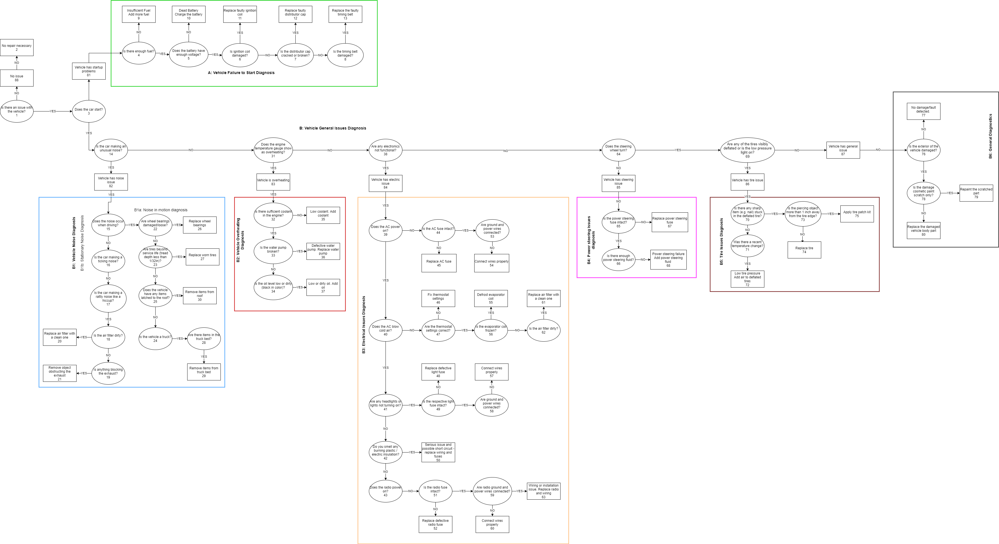

# Car Diagnosis and Repair Software

Artificial intelligence software to assist with diagnosing vehicle errors and damage. This proof-of-concept system employs Backward and Forward Chaining. 

Authors:     
* [David Torrente](https://github.com/torrente)
* [Borislav Sabotinov](https://github.com/bss8)
* [Randal Henderson](https://github.com/RRHenderson)

## Reports

Reports for all team members are located under:     
`resources/reports` directory. 

To navigate there, cd into the directory: 

`cd resources/reports`

## 1. Technical Specifications

### 1.1 Build and run the application 

This application is primarily designed to run on Texas State (TXST) Linux servers. 
Eros: EROS.CS.TXSTATE.EDU (147.26.231.153)
Zeus: ZEUS.CS.TXSTATE.EDU (147.26.231.156)

Upon invoking the program, the knowledge base (KB) file will be parsed and if correctly formatted, each statement (line) will be processed and displayed to the console.

### 1.2 Automated build with log file

Simply run the below command from the root directory:     
 `./buildAndRun.sh`

After a complete run, log will be in root dir as `vehicle_diagnosis.log`

### 1.3 Manual build (no log) 

To build locally, run this command in the root directory: `make`

To see the help menu:     
`./VehicleRepairAndDiagnosis -h` OR     
`./VehicleRepairAndDiagnosis -help`

To run: `./VehicleRepairAndDiagnosis`

Once KB file is loaded and variables list parsed, user is prompted for a conclusion.     
Upon entering a conclusion, the user will be prompted with questions until a solution is found (if available). 

### 1.4 Loading the Knowledge Base 

### 1.5 Error handling 
This section intentionally shows what CLI output would look like, given a defective KB file.    
If, after loading the KB file, you see this message: 

Then scroll up and look through the readout (alternatively, look through the generated vehicle_diagnosis.log file) for a line like this: 

The KB file line must be corrected for correct processing. 

### 1.6 Normal operation 

Once the KB file is corrected, the output should look like this: 

### 1.7 Using the application 

After the KB file is loaded, program will pause, allowing you to view output.     
Press Enter to continue. 

You'll be asked if you want to view the imported KB file in human readable form: 

If you select yes, KB will be printed to the console:

Otherwise program will continue. Regardless of the choice, after you either skip or print the KB, you'll be asked to enter a conclusion as shown above.  

The provided KB has two conclusions - issue and repair. If you select issue, follow the prompts as shown in this example: 

If you select repair, follow the prompts as shown in this example: 

## 2. Design 

### 2.1 Decision Tree Diagram 

The application comes with a pre-defined knowledge base for a vehicle repair and diagnosys system. 

### 2.2 Variables 

46 variables are used in the provided knowledge base. 

For a complete listing of all variables and their purpose, refer to [this list](resources/docs/Variables_for_Decision_Tree.xlsx) under `resources/docs/Variables_ForDecisionTree.xslx`. 

The premise variables are designed to be boolean type only.     
Each question is intentionally phrased as a yes or no question. For example, instead of asking the user to enter in the battery voltage as a number, the user is asked only - "Is sufficient voltage available in the battery (Y/n)?" 

The reason is because each battery manufacturer may have different voltage requirements. The user must refer to their user manual and determine the value. 

As an additional example - instead of asking the user to input their GPA and have the system determine whether it is above or below a certain treshold, the question would ask the student directly if their GPA is above a certain value (e.g., "Is your GPA above 3.5 (Y/n)?") 

This simplifies the design and the user experience, allowing the user to enter only yes or no for each question. 

### Class relationships 

BackChain has a VariableListItem and a KnowledgeBase    
ForwardChain has a VariableListItem, a KnowledgeBase, and ClauseItem (via queue)    
KnowledgeBase has a Statement     
Statement has a ClauseItem   

###  2.3 Why C++11? 

A small aside but worth mentioning. Why use c++11 compiler? C++11 now supports:

- lambda expressions,   
- automatic type deduction of objects,   
- uniform initialization syntax,   
- delegating constructors,   
- deleted and defaulted function declarations,    
- nullptr,     
- rvalue references   
 
"The C++11 Standard Library was also revamped with new algorithms, new container classes, atomic operations, type traits, regular expressions, new smart pointers, async() facility, and of course a multithreading library"      
 https://smartbear.com/blog/develop/the-biggest-changes-in-c11-and-why-you-should-care/

##  3. References 

1. Gaddis, Tony. "Starting out with C++ From Control Structures through Objects, Ninth Edition." Chapter 10 (c-strings & the string class), Chapter 17.3 the Vector Class.
2. Huntington, Dustin. "Back to Basics –. Backward Chaining: Expert System Fundamentals." http://www.exsys.com/pdf/BackwardChaining.pdf 
3. C++03 Standard [2.1.1.2]. https://gcc.gnu.org/legacy-ml/gcc/2001-07/msg01120.html